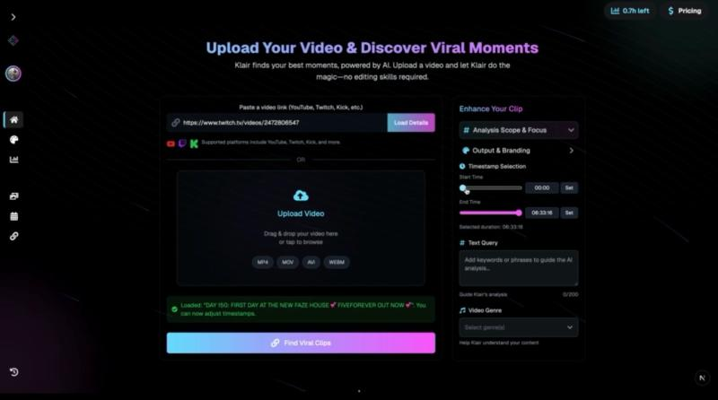
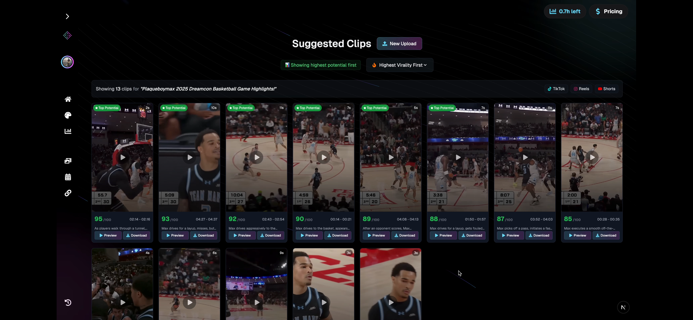
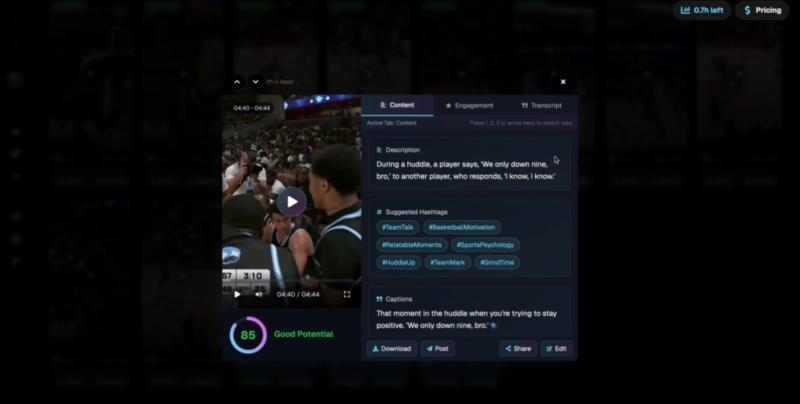
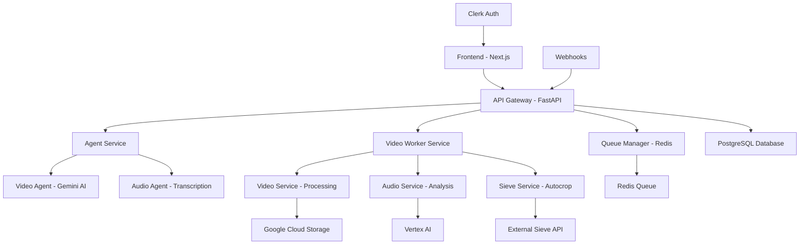

# Klair - AI-Powered Video Intelligence Platform

[🌐 Visit the Klair Website](https://www.clipdai.com)

## Dev

For frontend development details, see [frontend/README.md](frontend/README.md)

For backend development details, see [frontend/README.md](backend/README.md)

## 📖 Overview

Klair is a cutting-edge SaaS platform that leverages advanced multimodal AI to automatically analyze video content and identify potentially viral clips for social media platforms. Built for the creator economy and enterprise markets, Klair solves the critical pain point of manual video analysis that affects millions of content creators worldwide.

## Klair in Action 🚀

Here's a preview of the Klair user interface, from uploading a video to viewing AI-suggested clips.

### Main Dashboard
*Users can easily drag and drop video files for analysis.*


### Suggested Viral Clips
*The AI identifies and presents potential high-engagement clips with timestamps.*


### Detailed Clip Analysis
*Each clip comes with details that creators can use for their content.*


### 🎯 The Problem We Solve

- **Content creators** spend hours manually reviewing footage to find shareable moments
- **Streamers** struggle to identify engaging clips from long-form content
- **Enterprises** lack tools to analyze video performance and extract actionable insights
- **Marketers** need better understanding of what makes video content go viral

### ✨ Our Solution

Klair's **"Talk to Your Clips"** feature provides a conversational AI interface that not only generates clips but explains *why* they have viral potential, democratizing sophisticated video analytics for everyone.

---

## 🏗️ Architecture Overview



### 🔧 Core Components

- **Frontend**: React/Next.js application with real-time progress tracking
- **Backend**: FastAPI-based microservices architecture
- **AI Engine**: Google Gemini 2.5 Pro for multimodal video analysis
- **Queue System**: Redis-based async job processing
- **Storage**: Google Cloud Storage for video assets
- **Database**: PostgreSQL with SQLAlchemy ORM
- **Authentication**: Clerk for user management

---

## 💡 Key Features

### 🤖 AI-Powered Analysis
- **Multimodal Processing**: Simultaneous analysis of video, audio, and text
- **Viral Potential Scoring**: AI-driven assessment of content engagement potential
- **Conversational Insights**: Natural language queries about video performance
- **Smart Clip Generation**: Automated identification of highlight moments

### 🎥 Video Processing
- **Format Support**: MP4, MOV, AVI, WebM, and more
- **Cloud Integration**: Direct integration with major platforms (YouTube, Twitch)
- **Real-time Progress**: Live status updates during processing
- **Batch Processing**: Concurrent analysis of multiple videos

### 📊 Enterprise Features
- **Usage Analytics**: Comprehensive tracking and reporting
- **Tier Management**: Flexible subscription and resource allocation
- **API Access**: RESTful APIs for integration
- **Webhook Support**: Real-time notifications and callbacks

### 🎨 User Experience
- **Responsive Design**: Optimized for desktop and mobile
- **Drag & Drop**: Intuitive file upload interface
- **Real-time Updates**: WebSocket-based progress tracking
- **Export Options**: Multiple formats for social media platforms

---

## 🛠️ Tech Stack

### Frontend
- **Framework**: Next.js 15 with React 18
- **Language**: TypeScript
- **Styling**: Tailwind CSS with custom components
- **UI Library**: Radix UI primitives
- **Animation**: Framer Motion
- **State Management**: React hooks with context
- **Authentication**: Clerk integration

### Backend
- **Framework**: FastAPI with async/await
- **Language**: Python 3.11+
- **Database**: PostgreSQL with asyncpg
- **ORM**: SQLAlchemy 2.0
- **Queue**: Redis for job management
- **Authentication**: Clerk Backend SDK
- **Migration**: Alembic

### AI & Processing
- **AI Models**: Google Gemini 2.5 Pro via Vertex AI
- **Video Processing**: FFmpeg for encoding/transcoding
- **Audio Analysis**: Custom transcription pipeline
- **External Services**: Sieve for specialized video operations

### Infrastructure
- **Cloud Platform**: Google Cloud Platform
- **Storage**: Google Cloud Storage
- **Containerization**: Docker
- **Orchestration**: Cloud Run
- **Monitoring**: Structured logging with structured
- **CDN**: Google Cloud CDN

---

### Prerequisites

- **Node.js** 18+ and npm
- **Python** 3.11+
- **Docker** (optional)
- **PostgreSQL** database
- **Redis** instance
- **Google Cloud** account with Vertex AI enabled

---

## 📊 Project Structure

```
klair/
├── backend/                 # Python FastAPI backend
│   ├── api/                # API routes and models
│   ├── agents/             # AI agents for video/audio analysis
│   ├── core/               # Configuration and authentication
│   ├── db/                 # Database models and migrations
│   ├── services/           # Business logic layer
│   ├── utils/              # Utility functions
│   └── main.py            # Application entry point
├── frontend/               # Next.js React frontend
│   ├── app/               # Next.js app directory
│   ├── components/        # Reusable UI components
│   ├── lib/               # Utility libraries
│   └── public/            # Static assets
├── docker-compose.yml     # Multi-service deployment
├── Dockerfile            # Container configuration
└── README.md            # Project documentation
```

---

## 📈 Performance & Scalability

- **Concurrent Processing**: Handles multiple video analysis jobs simultaneously
- **Horizontal Scaling**: Stateless architecture supports multiple instances
- **Caching**: Redis caching for frequently accessed data
- **CDN Integration**: Global content delivery via Google Cloud CDN
- **Database Optimization**: Indexed queries and connection pooling

---

## 🔒 Security & Privacy

- **Authentication**: Secure JWT-based authentication with Clerk
- **Data Encryption**: All data encrypted in transit and at rest
- **Privacy Compliance**: GDPR and CCPA compliant data handling
- **Rate Limiting**: API rate limiting to prevent abuse
- **Input Validation**: Comprehensive validation of all user inputs

